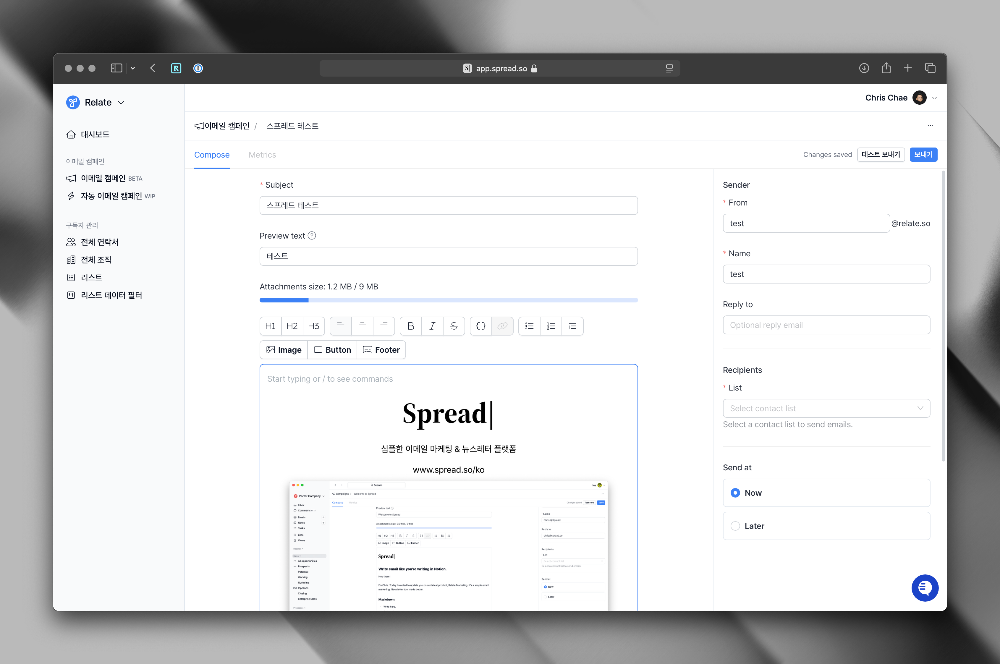

## Overview

Learn how to send your first email campaign with Spread.

## Before sending

Before sending an email campaign with Spread, read below to understand how Spread works and ensures email deliverability.

1. Spread is a platform for sending emails to bulk audiences such as customers, users, and subscribers.
2. Spread uses minimal styling and mainly plain text emails by default to ensure email deliverability. You can use HTML and CSS to style your emails, but please be aware that it may affect email deliverability.
3. Do not send cold emails using Spread. Sending bulk emails to people who have not agreed to receive emails is prohibited by law, and it may damage your domain reputation so that you cannot send emails normally.
4. If you have a large number of recipients (e.g. thousands or even tens of thousands), we suggest you to warm up your domain and clean up your list before sending emails. Please refer to the [Manage lists](/manage-lists) page for more information.

<Accordion title="What if I want to send cold emails?">

Don't send cold emails using Spread. Instead, Spread can perfectly sync with Relate CRM, which provides the ability to send cold emails through its [Engage](https://www.relate.so/engage) feature.

Check out the [Relate CRM](/crm) to learn more.
</Accordion>

## Basics

### 1. Write an email

Go to the campaign page by clicking **Email campaign** in the left menu. Then, click `+ Campaign` to create a new campaign.



When writing an email campaign, please fill in the following information.

- Subject: Email subject
- Preview: (Optional) Preview text is a one-line description that appears after the subject in the customer's inbox. You can write a summary of the email content or highlight the key topic or benefit.

#### Write email body

Spread has an editor that allows you to write emails like you would in Notion. If you are familiar with markdown, you can use it to style your email.

You can also use the toolbar at the top of the editor to apply various styles to the text, add images/resize/position them. Even if you don't select the toolbar, you can see the text styling, button, and image addition menu by entering `/` in the editor.

Finally, add a Call-to-action (CTA) element by using the button. If the button or a separate hyperlink and link is included, you can check the email open and link-based click status after sending in [Metrics](/metrics).

#### Email Footer content settings

Spread recommends sending emails with a footer. Footer content can be set and customized for each campaign, and the default content is as follows.

- Help text on why the recipient is receiving this email
- Company name
- Company address
- A link that allows the recipient to unsubscribe directly

Example:

```
This email was sent to you because you subscribed to our newsletter.
Spread, 548 Market St, 42341 San Francisco, CA 94104
[[Unsubscribe]]
```

Spread allows you to enter your company name and address freely. In general, follow the order above.

#### Customize the unsubscribe link

You can customize the unsubscribe link for each campaign. Any text can be used as an unsubscribe link by enclosing it in double square brackets like `[[text]]`.

<Info>
The unsubscribe link is not available in test send, but it works fine in actual sending. If you have any questions, please contact us at we@spread.so.
</Info>

### 2. Set sender information

Sender information can be set for each email campaign.

**Sender**
- From: Enter the sender's email address.
- Name: Enter the sender's name.
- Reply-To: Enter the email address to receive replies from recipients. If it is the same as the sender's email address, leave it blank.

### 3. Select a list to send the email campaign

Select the list you want to send the email campaign to. If you don't have a list yet, you need to create one first in the [Lists](/manage-lists) page.

### 4. Schedule email campaigns

You can schedule the email campaign to be sent at a specific time. Choose the date and time you want to send the email campaign and click `Schedule`.

### 5. Remove Spread branding

Remove `Powered by Spread` branding by upgrading to a paid plan.v You can upgrade [here](https://admin.spread.so/settings/billing).